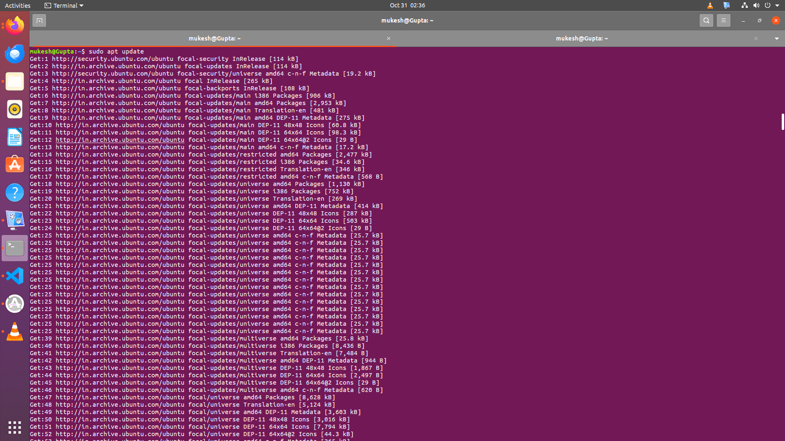
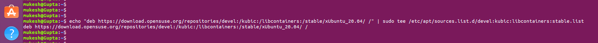
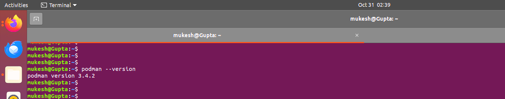
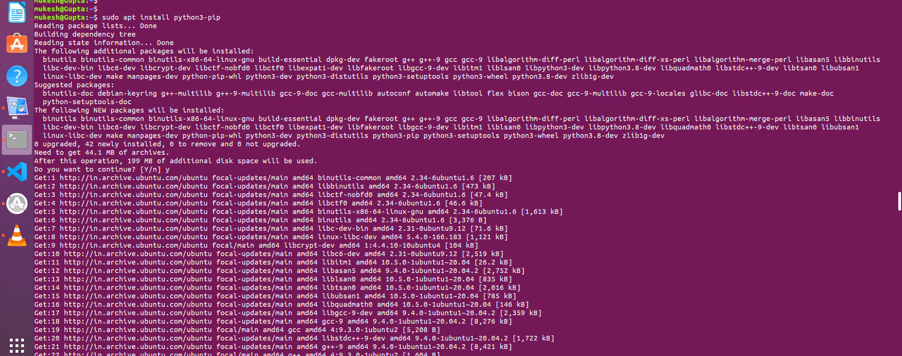
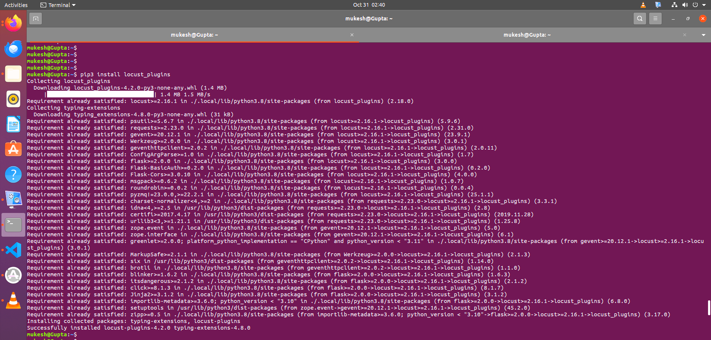
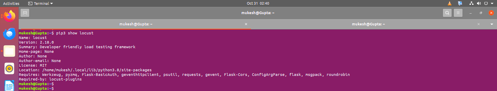
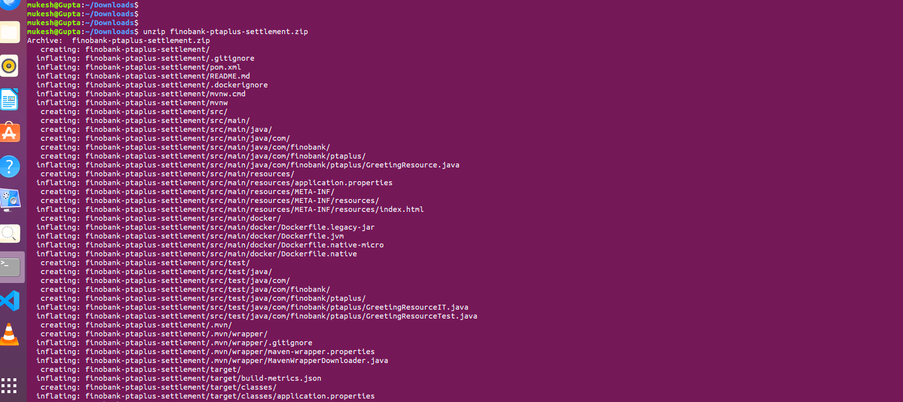
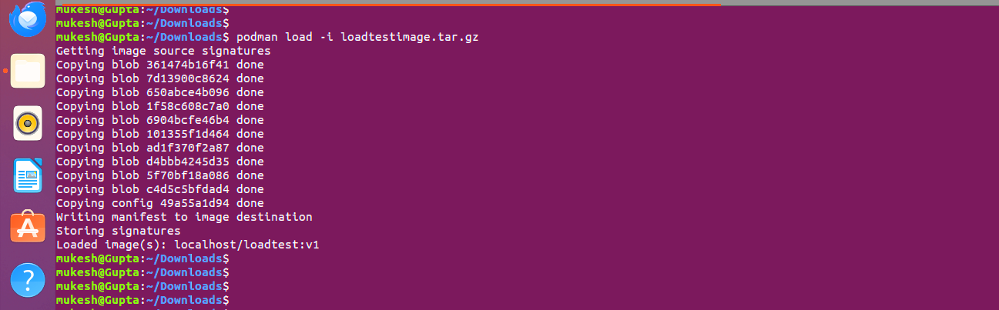
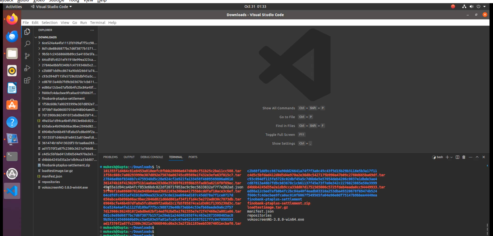
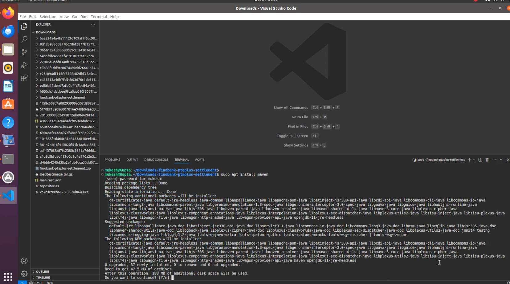

# 
Load Test Setup Document 

**1:- Task requirement:-**

To show the result of response time in grafana with the help of locust tool.

**2:- Load testing:-**

Load Testing is a non-functional software testing process in which the performance of software application is tested under a specific expected load. It determines how the software application behaves while being accessed by multiple users simultaneously.

**3:-Environmental detail:-**

OS: Ubuntu 20.04

Podman 3.4.2

**4:- System configuration:-**

CPU - 4

Storage -16 GB

**5:- List of tools and technologies:-**

Grafana
Postgres
Locust

**6:-Definition of tools:-** 

**(a). Grafana** is a multi-platform open source analytics and interactive visualisation web application. It provides charts, graphs, and alerts for the web when connected to supported data sources. It can be easily installed using Docker or Docker Compose.
PostgreSQL:   Post

**(b). PostgreSQL,** also known as Postgres, is a free and open-source relational database management system emphasising extensibility and SQL compliance.
Locust:

**(c). Locust** is an open-source load-testing tool. Load testing is a type of software testing that is conducted to check the tolerance/behaviour of the system under a specific expected load.
Command for the setup or configuration

### Installation Podman

**Step:- 1**

*Follow this step*

~~~
sudo apt update
~~~

The **sudo  apt  update** command is used in Debian-based Linux 
distributions, such as Ubuntu, to update the package repository 
information on your system. 

~~~
echo "deb https://download.opensuse.org/repositories/devel:/kubic:/libcontainers:/stable/xUbuntu_20.04/ /" | sudo tee /etc/apt/sources.list.d/devel:kubic:libcontainers:stable.list
~~~

~~~
curl -L "https://download.opensuse.org/repositories/devel:/kubic:/libcontainers:/stable/xUbuntu_20.04/Release.key" | sudo apt-key add -
~~~

~~~
sudo apt update
~~~

The **sudo  apt  update** command is used in Debian-based Linux 
distributions, such as Ubuntu, to update the package repository 
information on your system. 

~~~
sudo apt upgrade
~~~

The **sudo apt upgrade** command is used in Linux-based operating systems, such as Ubuntu, to update the installed packages on your system to their latest versions.

~~~
sudo apt -y install podman
~~~

The command s**udo apt -y install podman** is used to install the Podman container management tool on a system running a Debian-based Linux distribution. Podman is an alternative to Docker, designed to manage containers.

**sudo:** Superuser "do." It is used to execute a command with administrative or superuser privileges.

**apt:** Advanced Package Tool. It is a package management system used by Debian and Debian-based distributions.

**install:** The command used to install new packages.

**upgrade** This is a command used with apt-get to upgrade installed packages. When you run apt-get upgrade, it downloads and instals the latest versions of all currently installed packages on your system.

**-y** The -y is like saying, "Yes, go ahead!" It tells the magic tool to answer "Yes" to any questions it might ask during the installation, so you don't have to type "Yes" manually.

~~~
podman --version
~~~

**Step 2:-**

~~~
sudo apt install python3-pip
~~~

The command **sudo apt install python3-pip** is used to install the Python package manager called pip for Python 3.x. Let's break down what this command does

**sudo:** Superuser "do." It is used to execute a command with administrative or superuser privileges. 

**apt:** Advanced Package Tool. It is a package management system used by Debian and Debian-based distributions.

**install:** The command used to install new packages.

**python3-pip:** The name of the package you want to install. In this case, it's the Python 3 version of the pip package.

**Step 3:-**
~~~
pip3 install locust
~~~

**locust** is an open-source load testing tool that simulates a large number of users accessing your application simultaneously.

**pip3:** The package installer for Python3

**install:** The command to install a Python package. 

**locust:** The name of the package you want to install (in this case, Locust).

**Step 3:-**

~~~
pip3 install locust_plugins
~~~

**locust_plugins** is a package that extends the functionality of the Locust load testing tool, offering additional features and integrations. 

**pip3:** The package installer for Python3

**install:** The command to install a Python package.

**locust_plugins:** The name of the package you want to install (in this case, the Locust plugins package).

**Step 4:-**

~~~
pip3 show locust
~~~

**pip3:** The package installer for Python 3. It is a command-line tool for installing and managing Python packages.

**show:** A subcommand of pip used to display information about one or more installed packages.

**locust:** The name of the package for which you want to retrieve information. In this case, it's the Locust package

**Step 5:-**

~~~
sudo mkdir locust
~~~

The command **sudo mkdir locust** is a Unix/Linux command that creates a new directory (folder) named "locust" with administrative privileges using the sudo command.

~~~
ls
~~~

The **ls** command is used in Unix and Unix-like operating systems (including Linux) to list files and directories in a directory.
 
 

~~~
sudo touch locustfile.py
~~~

The command you mentioned, **sudo touch locustfile.py**, is a Unix/Linux command used to create a new file named locustfile.py

~~~
ls
~~~

**Step 6:-**

~~~
hostname -I
~~~

**Change the IP address , according to your System IP**

**Step 7:-**

~~~
sudo apt install vim
~~~

The command **sudo apt install vim** is used in Linux to install the Vim text editor. Let me explain why you might want to use Vim:

**Step 8:-**
~~~
sudo vim locustfile.py
~~~

**Step 9:-**

~~~
from locust import HttpUser, constant, task, between, TaskSet, SequentialTaskSet, events
import locust_plugins

@events.test_start.add_listener
def on_test_start(environment, **kwargs):
	print("A new test is starting")

@events.test_stop.add_listener
def on_test_stop(environment, **kwargs):
	print("A new test is ending")

class InactiveUsers(SequentialTaskSet):
	@task
	def helloworld(self):
    	with self.client.get("/hello", catch_response=True, name="helloworld", json={} , headers={"accept": "application/json", "Content-Type": "application/json"}) as response:
        	if response.status_code != 200:
            	response.failure("Failed to get item: StatusCode " + str(response.status_code))
        	else:
            	json_response_data = response.json()

class MyInactiveUsers(HttpUser):
	wait_time = between(1,2)
	tasks = [InactiveUsers]
	host = "http://192.168.122.29:8080"

~~~

**Step 10:-**

~~~
cd Download/
~~~

~~~
ls
~~~

~~~
unzip finobank-ptaplus-settlement.zip
~~~

**Step 11:-**

~~~
ls
~~~

~~~
tar -zxvf loadtestimage.tar.gz
~~~

**Step 12:-**

~~~
podman load -i loadtestimage.tar.gz
~~~

The command you provided, **podman load -i loadtestimage.tar.gz**, is used in the context of containerization. Let me break it down for you

**Step 13:-**
~~~
podman images
~~~

**podman images** is a command-line interface (CLI) command used in Podman, a containerization tool similar to Docker. It is used to list the locally available container images on your system. 

**Step 14:-**

~~~
sudo apt update
~~~

~~~
sudo snap install --classic code
~~~

~~~
code .
~~~

**Step 15:-**

~~~
ls
~~~

~~~
cd finobank-ptaplus-settlement/
~~~

~~~
sudo apt install maven
~~~

**Step 16:-**

~~~
mvn clean compile quarkus:dev -DskipTest
~~~

The command **mvn clean compile quarkus:dev -DskipTests** is used in the context of developing applications using the Quarkus framework in Java.

**Step 17:-** **Change the IP address , according to your System IP**

~~~
mvn clean compile quarkus:dev -DskipTests -Dquarkus.http.host=192.168.122.82
~~~

**Step 18:-** **Go to main terminal**

~~~
cd
~~~

~~~
locust -f locustfile.py
~~~

The command **locust -f locustfile.py** is used to run performance tests using Locust, which is an open-source load testing tool. Let's break down the command

**Step 19:-**

~~~
podman run -itd --name loadtesting -p 8089:8089 -v <Directory >:/mnt/locust localhost/loadtest:v1 -f /mnt/locust/locustfile.py
~~~

The command **podman run -itd --name loadtesting -p 8089:8089 -v <Directory>:/mnt/locust localhost/loadtest:v1 -f /mnt/locust/locustfile.py** is used to run a containerized instance of a load testing tool using Podman. Let's break down the command

**Step 20:-**

~~~
podman ps
~~~

The **podman ps** command is used to list running containers and provide information about them. 

~~~
locust -f locustfile.py
~~~

The command **locust -f locustfile.py** is used to run performance tests using Locust, which is an open-source load testing tool. Let's break down the command

**Step 21:-**

**Go to the browser type localhost:8089***

**Step 22:-**

~~~
podman pod create --name timescale --publish 5432:5432 --publish 3000:3000
~~~

**podman** command-line tool is used to manage pods on your system.

**pod** subcommand indicates that you are working with pods, rather than individual containers.

**create** subcommand is used to create a new pod.

**--name timescale** sets the name of the new pod to "timescale". This is a user-defined label that can be used to refer to the pod in subsequent commands.

**--publish 5432:5432** maps port 5432 on the host system to port 5432 within the pod. This enables external services to communicate with a PostgreSQL database that may be running inside the pod.

**--publish** 3000:3000 maps port 3000 on the host system to port 3000 within the pod. This enables external services to communicate with a Grafana application that may be running inside the pod.

~~~
podman pod ps
~~~

**podman pod ps** command is used to list the pods currently running on your system when you're using Podman, which is a container management tool similar to Docker.

~~~
cd
~~~

~~~
cd Downloads/
~~~

~~~
mkdir -p ~/postgres/data/ ~/grafana/data
~~~

~~~
vim script.sh
~~~

**Put this script**

~~~
#!/bin/bash

# Create the first directory
mkdir -p /home/user/Downloads/postgres/data

# Create the second directory
mkdir -p /home/user/Downloads/grafana/data

# Create a postgres container, give it the desired environment variables,
# attach it to the created pod
podman run -dt \
     --pod timescale \
     --name timescale-postgres \
     -e POSTGRES_PASSWORD=password \
     -e TIMESCALEDB_TELEMETRY=off \
     -v /home/user/Downloads/postgres/data:/var/lib/postgresql/data \
     cyberw/locust-timescale:4

# Create the grafana container, give it the desired environment variables,
# importantly PGHOST, attach it to the created pod
podman run -dt \
     --pod timescale \
     --name timescale-grafana \
     -e GF_AUTH_DISABLE_LOGIN_FORM=true \
     -e GF_AUTH_ANONYMOUS_ENABLED=true \
     -e GF_AUTH_ANONYMOUS_ORG_ROLE=Admin \
     -e GF_SECURITY_ALLOW_EMBEDDING=true \
     -e GF_LOG_LEVEL=warn \
     -e PGHOST=localhost \
     -v /home/user/Downloads/grafana/data:/var/lib/grafana \
     cyberw/locust-grafana:2
~~~

~~~
pwd
~~~

***Step 25:-**

~~~
chmod 775 script.sh
~~~

The command **chmod 775 script.sh** is used to change the permissions of a file named script.sh. 

**Step 26:-**

~~~
bash  script.sh
~~~

~~~
Step 27:-
~~~

~~~
podman ps
~~~

**podman** command-line tool is used to manage pods on your system.

**ps** subcommand lists the current status of all running pods.

**Step 28:-**

~~~
cd ~/grafana/
~~~

**Step 29:-**
~~~
sudo apt install jq
~~~

**Step 31:-**

~~~
Vim pipeline.sh
~~~

**Put this script**

~~~
GRAFANA_CRED="admin:admin"
GRAFANA_HOST="http://192.168.1.101:3000"
GRAFANA_OVERWRITE=false
DS_NAME="locust_timescale"
PGHOST="postgres"
PGPORT="5432"

curl -u "$GRAFANA_CRED" $GRAFANA_HOST/api/datasources -XPOST -H "Accept: application/json" -H "Content-Type: application/json" -d '{"access": "proxy","basicAuth": false,"basicAuthPassword": "","basicAuthUser": "","database": "postgres","isDefault": false,"jsonData": {"postgresVersion": 1200,"sslmode": "disable", "timescaledb": true},"name": "'$DS_NAME'","orgId": 1,"password": "","readOnly": false,"secureJsonData": {"password": "password"},"type": "postgres","url": "'$PGHOST':'$PGPORT'","user": "postgres","version": 3,"withCredentials": false}'

ds=(10878 14423 14422 15419);
for d in "${ds[@]}"; do
  echo -n "Processing $d: "
  j=$(curl -s -k -u "$GRAFANA_CRED" $GRAFANA_HOST/api/gnet/dashboards/$d | jq .json)
  echo "{\"dashboard\":"${j}",\"overwrite\":$GRAFANA_OVERWRITE,\"inputs\":[{\"name\":\"DS_LOCUST\",\"type\":\"datasource\", \"pluginId\":\"postgres\",\"value\":\"$DS_NAME\"}]}" > payload.json
  curl -v -k -u "$GRAFANA_CRED" -H "Accept: application/json"\
	-H "Content-Type: application/json"\
	-d @payload.json \
	$GRAFANA_HOST/api/dashboards/import; echo ""
done
~~~

##### Check if Grafana is ready before proceeding
check_grafana_ready

##### Create datasource
create_datasource

##### Import dashboards
import_dashboards

**Step 32:-**

~~~
bash pipeline.sh
~~~

**Step 33:-**

~~~
cd
~~~

~~~
podman exec -it timescale-postgres bash
~~~

**Step 34:-**

~~~
psql -U postgres
~~~

**Step 35:-**

~~~
\dt
~~~

**Step 36:-**

~~~
select * from user_count;
~~~

**Step 37:-**

~~~
podman run -itd --name loadtesting -p 8089:8089 -v /home/sam:/mnt/locust localhost/loadtest:v1 -f /mnt/locust/locustfile.py --timescale --grafana-url=http://192.168.122.82:3000 --pogport=192.168.122.82 --pgport=5432 --pgpassword=password --pguser=postgres
~~~

The **command you provided, podman run -itd --name loadtesting -p 8089:8089 -v /home/sam:/mnt/locust localhost/loadtest:v1 -f /mnt/locust/locustfile.py --timescale --grafana-url=http://192.168.122.82:3000 --pogport=192.168.122.82 --pgport=5432 --pgpassword=password --pguser=postgres**, is a command for running a containerized load testing environment using Podman.

**Step 38:-**

Run the load test with grafana and timescale-DB
Locust ui exposed to the localhost:8089 Start a new test with the number of users and spawn rate.

**Step 39:-**
You can add panels in grafana to get the graphical view of the responses.

